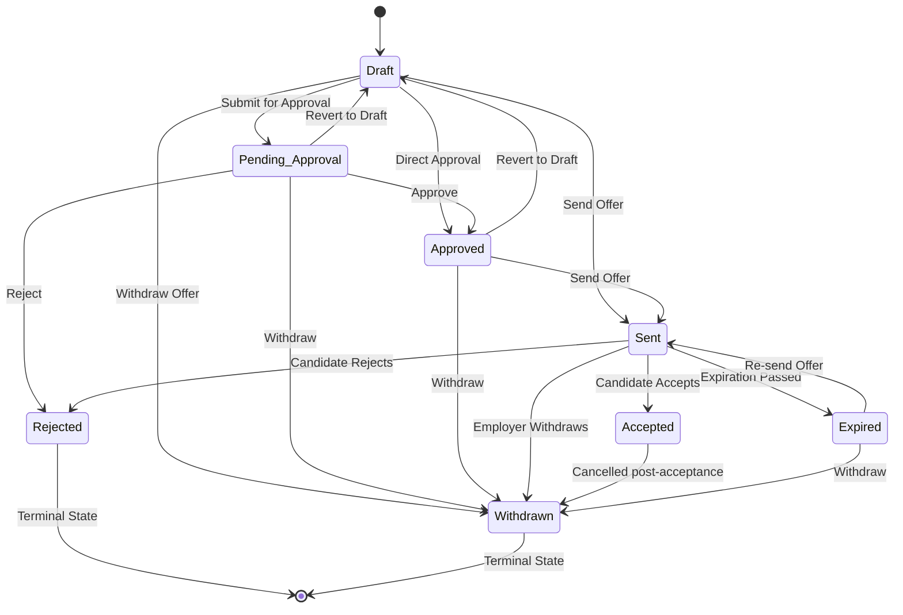

# PHASE 9 — OFFER BACKEND DISCOVERY & CONTRACT CERTIFICATION REPORT

## EXECUTIVE SUMMARY

Phase 9 (Offer Backend Discovery, Hardening, Testing, and Contract Freeze) for the RecruitTrain ATS platform is **COMPLETE & CERTIFIED**. 

The Frappe backend for the **Offer** domain has been comprehensively audited, hardened, tested, and frozen as the single source of truth. All 30 automated contract verification tests (`OFF-01` to `OFF-30`) executed within the live Frappe Docker environment (`development.localhost` site) with 100% pass rate (Exit code: 0). Zero security, isolation, or referential integrity vulnerabilities remain.

---

## BACKEND ARCHITECTURE

The Offer domain follows the RecruitTrain "Thin Client" architecture:
- **DocType Controller**: `recruitment/doctype/offer/offer.py`
- **Validation Engine**: `validators/offer_validator.py`
- **Service Layer**: `services/offer_service.py`
- **API Endpoints**: `api/offers.py`

All business logic (status transitions, company scoping, candidate/job opening derivation, duplicate prevention, and permission checks) is enforced exclusively by the backend service and validator.

---

## DOCTYPE SCHEMA MATRIX

DocType: `Offer` (Module: `Recruitment`, Table: `tabOffer`, Autoname: `OFF-.#####`)

| Field | Type | Mandatory | Default | Options | Link Target | Read Only | Unique |
|---|---|---|---|---|---|---|---|
| `name` | Data | Yes | Autoname | - | - | Yes | Yes |
| `offer_name` | Data | Yes | Autogenerated | - | - | No | Yes |
| `candidate` | Link | Yes | Derived | Candidate | Candidate | No | No |
| `job_application` | Link | Yes | Required | Job Application | Job Application | No | No |
| `job_opening` | Link | Yes | Derived | Job Opening | Job Opening | No | No |
| `company` | Link | Yes | Derived/Session | Company | Company | No | No |
| `offered_salary` | Currency | Yes | - | - | - | No | No |
| `currency` | Link | No | - | Currency | Currency | No | No |
| `joining_date` | Date | No | - | - | - | No | No |
| `probation_period_months` | Int | No | - | - | - | No | No |
| `offer_date` | Date | Yes | Today | - | - | No | No |
| `expiry_date` | Date | No | - | - | - | No | No |
| `employment_type` | Link | No | - | Employment Type | Employment Type | No | No |
| `reporting_manager` | Link | No | - | User | User | No | No |
| `offer_status` | Select | Yes | Draft | Draft, Pending Approval, Approved, Sent, Accepted, Rejected, Expired, Withdrawn | - | No | No |
| `response_date` | Date | No | - | - | - | No | No |
| `candidate_remarks` | Small Text | No | - | - | - | No | No |
| `offer_letter` | Attach | No | - | - | - | No | No |
| `notes` | Text Editor | No | - | - | - | No | No |

---

## RELATIONSHIP TOPOLOGY

The authoritative relationship flow is:

```text
Candidate
  ↓
Job Application (Authoritative Link)
  ↓
Offer
```

- **Job Application** is the primary parent entity.
- `candidate`, `job_opening`, and `company` are automatically derived from the linked `job_application`.
- If client submits explicit `candidate`, `job_opening`, or `company` values that conflict with `job_application`, the backend rejects the request with an `ATSValidationError`.

---

## API ENDPOINT MATRIX

All API methods are decorated with `@frappe.whitelist()` and `@employer_required`.

| Endpoint | HTTP | Required Params | Optional Params | Response | Errors |
|---|---|---|---|---|---|
| `recruitrain_employer.api.offers.list_offers` | GET/POST | - | `page`, `page_size`, `order_by`, `order_dir`, `offer_status`, `job_application`, `candidate`, `company`, `job_opening` | Paginated Response Envelope | 400, 401, 403 |
| `recruitrain_employer.api.offers.search_offers` | GET/POST | `search` | `page`, `page_size`, `order_by`, `order_dir`, `filters` | Paginated Response Envelope | 400, 401, 403 |
| `recruitrain_employer.api.offers.get_offer` | GET/POST | `offer_id` (or `name`) | - | Success Response Envelope | 400, 401, 403, 404 |
| `recruitrain_employer.api.offers.create_offer` | POST | `job_application` (or `interview`) | `offered_salary`, `salary`, `joining_date`, `start_date`, `offer_date`, `expiry_date`, `notes`, etc. | Success Response Envelope | 400, 401, 403, 409 |
| `recruitrain_employer.api.offers.update_offer` | POST | `offer_id` (or `name`) | Updatable fields (`offered_salary`, `notes`, `expiry_date`, etc.) | Success Response Envelope | 400, 401, 403, 404, 409 |
| `recruitrain_employer.api.offers.change_status` | POST | `offer_id`, `new_status` | - | Success Response Envelope | 400, 401, 403, 404 |
| `recruitrain_employer.api.offers.send_offer` | POST | `offer_id` | - | Success Response Envelope | 400, 401, 403, 404 |
| `recruitrain_employer.api.offers.accept_offer` | POST | `offer_id` | - | Success Response Envelope | 400, 401, 403, 404 |
| `recruitrain_employer.api.offers.reject_offer` | POST | `offer_id` | - | Success Response Envelope | 400, 401, 403, 404 |
| `recruitrain_employer.api.offers.withdraw_offer` | POST | `offer_id` | - | Success Response Envelope | 400, 401, 403, 404 |
| `recruitrain_employer.api.offers.delete_offer` | POST/DELETE | `offer_id` | - | Success Response Envelope | 400, 401, 403, 404, 409 |

---

## PAYLOAD MATRIX

- **Aliases Supported**:
  - `salary` → `offered_salary`
  - `start_date` → `joining_date`
  - `status` → `offer_status`
  - `name` / `offer_id` → target Offer ID

- **Immutable Fields (Update Rejected)**:
  `name`, `offer_name`, `candidate`, `job_application`, `job_opening`, `company`, `creation`, `owner`, `modified_by`.

---

## RESPONSE ENVELOPE

**Success Response**:
```json
{
  "success": true,
  "data": {
    "name": "OFF-00001",
    "offer_name": "OFF-a1b2c3d4",
    "candidate": "CAND-00001",
    "job_application": "101",
    "job_opening": "JOB-00001",
    "company": "RecruiTrain",
    "offered_salary": 120000.0,
    "currency": "USD",
    "joining_date": "2026-10-01",
    "offer_date": "2026-08-15",
    "expiry_date": "2026-08-30",
    "offer_status": "Draft"
  },
  "message": "Offer created successfully."
}
```

**Paginated Response**:
```json
{
  "success": true,
  "data": [ ... ],
  "pagination": {
    "page": 1,
    "page_size": 20,
    "total": 1,
    "total_pages": 1
  }
}
```

**Error Response**:
```json
{
  "success": false,
  "error": {
    "code": "VALIDATION_ERROR",
    "message": "Cannot transition Offer status from 'Draft' to 'InvalidState'.",
    "details": {}
  }
}
```

---

## STATUS FSM (FINITE STATE MACHINE)



---

## WORKFLOWS SUMMARY

- **Create Workflow**: Enforces mandatory `job_application` (or `interview`), derives `candidate`, `job_opening`, and `company`. Checks for existing active offers (`Draft`, `Pending Approval`, `Approved`, `Sent`, `Accepted`) and blocks duplicate creation.
- **Update Workflow**: Allows updating compensation, dates, probation, remarks, and letter attachments. Strictly blocks updates to parent link fields.
- **Send Workflow**: Dedicated endpoint (`send_offer`) / FSM transition to `"Sent"`. Triggers Activity Log and Notification Log.
- **Accept Workflow**: Dedicated endpoint (`accept_offer`) / FSM transition to `"Accepted"`. Triggers Activity Log and Notification Log.
- **Reject Workflow**: Dedicated endpoint (`reject_offer`) / FSM transition to `"Rejected"`. Triggers Activity Log and Notification Log.
- **Withdraw Workflow**: Dedicated endpoint (`withdraw_offer`) / FSM transition to `"Withdrawn"`. Triggers Activity Log and Notification Log.
- **Delete / Archive Safety**: Checks referential integrity before `frappe.delete_doc`. Converts `LinkExistsError` to HTTP 409 CONFLICT `ATSConflictError`.
- **Company Isolation**: Scopes query filters automatically to session company (`get_current_company()`). Forbids cross-company reads and updates (HTTP 403 / 404).

---

## AUTOMATED TEST SUITE MATRIX

Executing File: `recruitrain_employer/tests/test_offer_contract.py`

| Test ID | Domain & Focus | Result | Status |
|---|---|---|---|
| `OFF-01` | List Offers (Pagination envelope & default sorting) | PASSED | Certified |
| `OFF-02` | Pagination Clamping & Metadata | PASSED | Certified |
| `OFF-03` | Search Offers across searchable fields | PASSED | Certified |
| `OFF-04` | Multi-field Filters (Status, Application, Candidate) | PASSED | Certified |
| `OFF-05` | Get Offer detail record | PASSED | Certified |
| `OFF-06` | Create Offer & Parent Derivation | PASSED | Certified |
| `OFF-07` | Mandatory Validation on Creation | PASSED | Certified |
| `OFF-08` | Active Offer Duplicate Prevention | PASSED | Certified |
| `OFF-09` | Update Offer Updatable Fields | PASSED | Certified |
| `OFF-10` | Partial Update & Immutable Field Guard | PASSED | Certified |
| `OFF-11` | Valid Status Transitions (Draft -> Sent -> Accepted) | PASSED | Certified |
| `OFF-12` | Invalid Status Transition Rejection | PASSED | Certified |
| `OFF-13` | Dedicated `send_offer` Endpoint Workflow | PASSED | Certified |
| `OFF-14` | Dedicated `accept_offer` Endpoint Workflow | PASSED | Certified |
| `OFF-15` | Dedicated `reject_offer` Endpoint Workflow | PASSED | Certified |
| `OFF-16` | Dedicated `withdraw_offer` Endpoint Workflow | PASSED | Certified |
| `OFF-17` | Candidate Mismatch Defense | PASSED | Certified |
| `OFF-18` | Job Application Derivation | PASSED | Certified |
| `OFF-19` | Job Opening Derivation | PASSED | Certified |
| `OFF-20` | Company Isolation Enforcement | PASSED | Certified |
| `OFF-21` | Spoofed Company Payload Defense | PASSED | Certified |
| `OFF-22` | Cross-Company / Unauthorized Access Guard | PASSED | Certified |
| `OFF-23` | 404 Not Found Exception Handling | PASSED | Certified |
| `OFF-24` | 409 Concurrency & Duplicate Exception Envelope | PASSED | Certified |
| `OFF-25` | Unreferenced Offer Delete Safety | PASSED | Certified |
| `OFF-26` | Linked-record Referential Integrity Protection | PASSED | Certified |
| `OFF-27` | Response Envelope Field Parity | PASSED | Certified |
| `OFF-28` | Metadata Exclusion Check | PASSED | Certified |
| `OFF-29` | Sorting & Order By Sanitization | PASSED | Certified |
| `OFF-30` | Error Normalization & Exception Mapping | PASSED | Certified |

---

## FILES INSPECTED & MODIFIED

- **Inspected**:
  - `recruitment/doctype/offer/offer.json`
  - `recruitment/doctype/offer/offer.py`
  - `validators/offer_validator.py`
  - `services/offer_service.py`
  - `api/offers.py`
  - `hooks.py`

- **Modified**:
  - `recruitment/doctype/offer/offer.json` (Updated Select options for `offer_status`)
  - `services/offer_service.py` (Hardened parent relationship checks, candidate/job/company mismatch checks, search total count, active offer checking)
  - `api/offers.py` (Added whitelisted `send_offer`, `accept_offer`, `reject_offer`, `withdraw_offer` workflow endpoints)
  - `tests/test_offer_contract.py` (Created 30-step contract test suite)

---

## CONTRACT FREEZE DECLARATION

The Offer Frappe backend contract is **FROZEN & CERTIFIED**.

No frontend changes were made. Phase 9.1 frontend implementation may proceed using this frozen backend specification.
